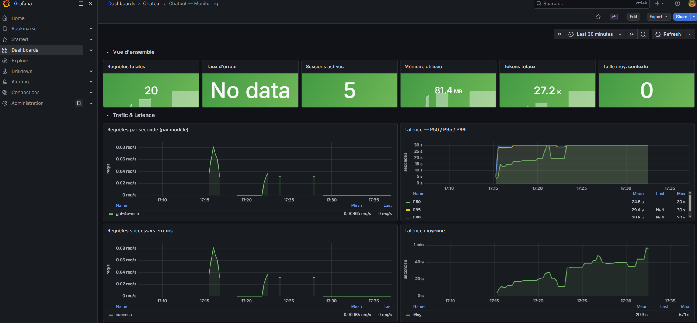
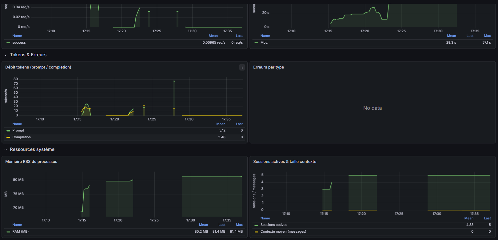

# Étape 08 — Prometheus & Grafana

## Objectif
Instrumenter le chatbot avec des métriques Prometheus et visualiser dans Grafana.

## Architecture
```
FastAPI → /metrics → Prometheus (scrape 15s) → Grafana (dashboard)
```

## Métriques exposées
| Métrique | Type | Description |
|----------|------|-------------|
| `chat_requests_total` | Counter | Nb requêtes par modèle/status |
| `chat_latency_seconds` | Histogram | Distribution latence |
| `chat_tokens_total` | Counter | Tokens prompt/completion |
| `process_memory_bytes` | Gauge | RAM du processus |
| `chat_active_sessions` | Gauge | Sessions actives |
| `chat_errors_total` | Counter | Erreurs par type |

## Lancement
```bash
cp .env.example .env
docker-compose up --build -d
```

## Accès
- API : http://localhost:8000/docs
- Métriques raw : http://localhost:8000/metrics
- Prometheus : http://localhost:9090
- Grafana : http://localhost:3000 (admin / admin123)

## Générer du trafic
```bash
pip install httpx
python send_test_requests.py http://localhost:8000 50
```

## Requêtes PromQL utiles
```promql
# Latence P95
histogram_quantile(0.95, rate(chat_latency_seconds_bucket[5m]))

# Requêtes par seconde
rate(chat_requests_total[1m])

# Mémoire en MB
process_memory_bytes / 1024 / 1024
```

## Exercice
1. Lancez la stack : `docker-compose up --build -d`
2. Envoyez 50 requêtes : `python send_test_requests.py`
3. Ouvrez Prometheus : vérifiez que les métriques sont scraped
4. Ouvrez Grafana : créez un dashboard avec latence P95 et RPS
5. Bonus : ajoutez une alerte si latence P95 > 5s


# Grafana exemple


