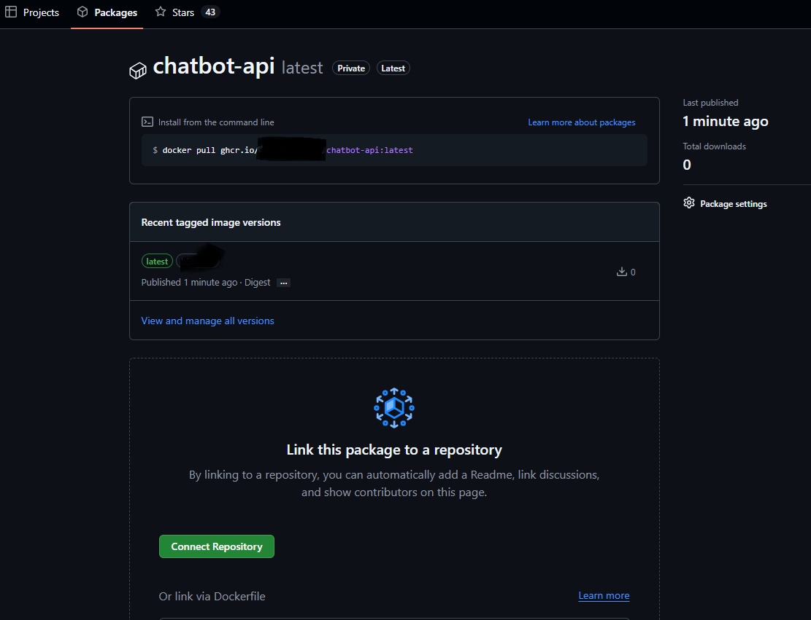

# Étape 13 — Deployable

Version production-ready du chatbot : toutes les fonctionnalités des étapes précédentes
réunies en une seule app conteneurisée, testée et monitorée.

---

## Ce qui est inclus


| Fonctionnalité                                   | Vient de      |
| ------------------------------------------------- | ------------- |
| LangChain + support cloud/local                   | Étape 06     |
| RAG ChromaDB (optionnel, graceful fallback)       | Étapes 04/05 |
| Prometheus + Grafana + alertes                    | Étape 08     |
| JWT + Rate limiting + Prompt injection guard      | Étape 09     |
| Suite de tests (unit / intégration / sécurité) | Étape 11     |
| Dockerfile multi-stage (build → test → prod)    | Nouveau       |
| Tests bloquants au build Docker                   | Nouveau       |
| Nginx reverse proxy avec TLS                      | Nouveau       |
| Script d'évaluation RAG avec keywords            | Nouveau       |

---

## Démarrage — première fois

Suivre ces étapes dans l'ordre.

### 1. Configuration

```bash
cp .env.example .env
```

Éditer `.env` et renseigner au minimum :

```env
# Mode cloud (OpenAI)
OPENAI_API_KEY=sk-...
MODEL=gpt-4o-mini

# Ou mode local (LM Studio / Ollama)
MODE=local
LOCAL_BASE_URL=http://host.docker.internal:1234/v1
LOCAL_MODEL=mistral-7b-instruct

# Sécurité — générer avec : python -c "import secrets; print(secrets.token_hex(32))"
SECRET_KEY=changez-moi-en-prod
```

### 2. Lancer la stack

```bash
make dev-bg        # démarre en arrière-plan (API + Prometheus + Grafana)
# ou
make dev           # démarre avec les logs en direct
```

La première fois, Docker installe toutes les dépendances (~3 min).
Les tests s'exécutent **automatiquement pendant le build** — si un test échoue, le build bloque.

### 3. Vérifier que tout est up

```bash
make status
# ou
curl http://localhost:8000/health
```

Réponse attendue :

```json
{"status": "ok", "rag_available": false, "version": "4.0.0", ...}
```

### 4. Indexer les documents RAG

Sans cette étape, le chatbot répond en mode LLM classique (sans base documentaire).

```bash
make index-rag-docker
```

Le modèle d'embedding (~79 MB) se télécharge une seule fois dans le volume Docker.
Les exécutions suivantes sont instantanées.

Après indexation, redémarrer le chatbot pour prendre en compte la nouvelle collection :

```bash
docker-compose restart chatbot
curl http://localhost:8000/health   # rag_available doit être true
```

### 5. Tester l'API

```bash
# Obtenir un token JWT
curl -X POST http://localhost:8000/auth/token \
  -d "username=alice&password=password123"

# Envoyer un message (remplacer le token)
curl -X POST http://localhost:8000/chat \
  -H "Authorization: Bearer <token>" \
  -H "Content-Type: application/json" \
  -d '{"message": "Quel est le prix de CloudSync Pro ?"}'
```

Ou directement via Swagger : **http://localhost:8000/docs**

### 6. Vérifier les métriques dans Grafana

1. Ouvrir **http://localhost:3000** — login : `admin` / valeur de `GRAFANA_PASSWORD` dans `.env` (défaut : `change-this-grafana-password`)
2. Aller dans **Dashboards → Chatbot → Chatbot Monitoring**
3. Générer du trafic : `make smoke` (5 questions rapides)

---

## Commandes disponibles

```bash
make help          # liste toutes les commandes
```


| Commande                       | Description                                                   |
| ------------------------------ | ------------------------------------------------------------- |
| `make dev`                     | Lance la stack avec logs en direct                            |
| `make dev-bg`                  | Lance en arrière-plan                                        |
| `make stop`                    | Arrête tous les services                                     |
| `make status`                  | Affiche l'état + health check                                |
| `make logs`                    | Suit les logs de l'API                                        |
|                                |                                                               |
| `make test`                    | Lance les tests dans Docker (recommandé)                     |
| `make test-local`              | Lance les tests localement                                    |
| `make test-security`           | Analyse statique bandit                                       |
|                                |                                                               |
| `make index-rag`               | Indexe les docs localement (hors Docker)                      |
| `make index-rag-docker`        | Indexe les docs**dans** le conteneur (à utiliser)            |
|                                |                                                               |
| `make smoke`                   | 5 questions rapides pour vérifier l'API + alimenter Grafana  |
| `make eval`                    | Évaluation complète : 15 questions + vérification keywords |
| `make eval-verbose`            | Idem avec les réponses complètes affichées                 |
| `make smoke-no-rag`            | Smoke test sans RAG                                           |
|                                |                                                               |
| `make build`                   | Build complet avec tests puis image prod                      |
| `make build-skip-tests`        | Build sans tests (urgence seulement)                          |
| `make build-push`              | Build + push vers le registry (`REGISTRY` requis dans `.env`) |
|                                |                                                               |
| `make images`                  | Liste les images Docker buildées**localement**               |
| `make test-registry`           | Teste l'authentification sur ghcr.io (sans build ni push)     |
| `make registry-ls`             | Liste les images disponibles**sur ghcr.io**                   |
| `make registry-rm TAG=sha1234` | Supprime un tag distant sur ghcr.io                           |
|                                |                                                               |
| `make prod`                    | Lance la stack production avec Nginx                          |
| `make clean`                   | Supprime conteneurs, volumes et images locaux                 |

---

## Workflow quotidien

### Développement normal

```bash
make dev-bg        # démarrer
# ... modifier le code ...
make dev-bg        # rebuild auto (seules les layers modifiées sont reconstruites)
make smoke         # vérifier que ça répond
```

### Ajouter ou mettre à jour des documents RAG

1. **Déposer les fichiers** `.txt` dans `data/docs/`
2. **Réindexer dans le conteneur** :

```bash
make index-rag-docker-section   # méthode recommandée (sections)
# ou
make index-rag-docker-paragraph # méthode paragraphes (chunks plus petits)
```

Exemple essayer d'ajouter dans le répertoire /data un fichier /programme.txt avec par exemple:

```
Programme type de l'organisation interne de l'entreprise:

10h11: Stand-up de l'équipe
11h Réunion produit
12h Réunion ingénieur et produit
12h36: Repas
13h47: Réunion clients
16h11: Bilan de la journée
```

Essayer d'ajouter une question dans eval_set.jsonl:

```
{"id": "q004", "question": "A quelle heure a lieux la réunion client?", "expected_keywords": ["13", "47"], "category": "sla", "difficulty": "facile"}
```

3. **Redémarrer le chatbot** (la collection est chargée au démarrage) :

```bash
docker compose restart chatbot
curl http://localhost:8000/health   # rag_available doit être true
```

4. **Vérifier la qualité** :

```bash
make eval
```

> **Formats supportés** : `.txt` uniquement (encodage UTF-8).
> Le modèle d'embedding (~79 MB) est mis en cache dans le volume Docker après le premier téléchargement.

### Avant un commit / pull request

```bash
make test          # 73 tests, coverage ≥ 70% requis
make test-security # bandit : pas de vulnérabilité critique
```

---

## Services et accès


| Service                   | URL                           | Identifiants                                      |
| ------------------------- | ----------------------------- | ------------------------------------------------- |
| **API Swagger**           | http://localhost:8000/docs    | —                                                |
| **Health check**          | http://localhost:8000/health  | —                                                |
| **Métriques Prometheus** | http://localhost:8000/metrics | —                                                |
| **Prometheus UI**         | http://localhost:9090         | —                                                |
| **Grafana**               | http://localhost:3000         | admin / (valeur de`GRAFANA_PASSWORD` dans `.env`) |

### Utilisateurs de démo


| Utilisateur | Mot de passe | Usage                |
| ----------- | ------------ | -------------------- |
| alice       | password123  | Tests généraux     |
| bob         | secret456    | Tests multi-sessions |
| admin       | admin789     | Tests droits admin   |

---

## Architecture

```
Client
  │
  ├── dev  → FastAPI :8000 (direct)
  └── prod → Nginx :443 → FastAPI :8000
                            │
              ┌─────────────┼──────────────┐
              │             │              │
        JWT + Rate    LangChain LLM   Prometheus
        Limit +        │                /metrics
        Prompt      ┌──┴──────────┐
        Guard       │  ChromaDB   │  ← RAG optionnel
                    │  (optionnel)│
                    └─────────────┘
                         │
              ┌──────────┴──────────┐
              │                     │
           SQLite              Named volume
           (historique)        /app/data/
```

### Dockerfile multi-stage

```
Stage 1 : builder  → installe les dépendances Python
Stage 2 : test     → lance pytest (exit 1 si échec = build bloqué)
Stage 3 : production → image finale, user non-root, sans outils de build
```

Optimisation des layers : apt → pip → docs → code
→ Changer le code ne rebuild que les 2 dernières COPY layers.

---

## Évaluation de la qualité RAG

Le script `scripts/eval.py` envoie les questions de `data/eval_set.jsonl` à l'API
et vérifie que les mots-clés attendus sont dans la réponse.

```bash
make smoke         # 5 questions (rapide, pas de rate limit)
make eval          # 15 questions (pause auto si rate limit atteint)
make eval-verbose  # idem + réponses complètes affichées
```

Exemple de sortie :

```
[PASS] q001 Quel est le prix de CloudSync Pro ?     2.9s [RAG 3src]
[FAIL] q003 Qui est le CEO de TechCorp ?            1.9s [RAG 3src]
       → Je n'ai pas cette information dans ma base documentaire.
       ✗ manquants : Marie Dupont

Résultat : 7/15 PASS (47%)   1 PARTIEL   7 FAIL
```

Un score < 100% est normal : il indique les questions dont les chunks
ne remontent pas dans le top-3. Améliorer : ajuster la taille des chunks
dans `scripts/index_rag.py` ou enrichir les documents dans `data/docs/`.

---

## Image Docker — cycle de vie et limites

### Voir les images locales

Après un `make build`, l'image est stockée dans le daemon Docker local (pas dans le projet) :

```bash
make images
# ou
docker images chatbot-api
```

Elle est aussi visible dans **Docker Desktop → onglet Images**.

### Vérifier la connexion au registry

Avant tout push, vérifier que le token est valide :

```bash
make test-registry
# → Login OK — push autorisé
```

Prérequis dans `.env` :

```env
REGISTRY=ghcr.io/fabienquimper
REGISTRY_USER=fabienquimper
REGISTRY_TOKEN=ghp_xxx...    # token GitHub avec scope write:packages
```

Créer le token : GitHub → Settings → Developer settings → Personal access tokens → scope `write:packages`.

### Voir les images distantes sur ghcr.io

```bash
make registry-ls
```

Sortie après un premier push :

```
Images disponibles sur ghcr.io pour fabienquimper :

  chatbot-api                    updated: 2026-04-11
```

### Supprimer un tag distant

```bash
make registry-rm TAG=b5b88ec    # le SHA git affiché au build
```

> Le token doit avoir le scope `delete:packages` en plus de `write:packages`.

### Ce que fait (et ne fait pas) le `--push`

```
make build-push   # nécessite REGISTRY dans .env
```

**Ce que ça fait :** construit l'image et la pousse vers le registry configuré.
L'image devient accessible depuis n'importe quelle machine avec `docker pull ghcr.io/fabienquimper/chatbot-api:sha1234`.

**Ce que ça ne fait pas :** déployer sur un serveur distant. L'étape 5 du `build.sh` (`docker compose up`) tourne **toujours en local** sur ta machine.



### Limites de cette étape

Cette étape s'arrête au push de l'image. Pour un vrai déploiement distant, il faudrait en plus :


| Ce qui manque              | Solution possible                     |
| -------------------------- | ------------------------------------- |
| Un serveur cible           | VPS, VM cloud (AWS EC2, Scaleway…)   |
| Accès SSH au serveur      | `ssh user@serveur docker compose up`  |
| Pipeline CI/CD automatisé | GitHub Actions (`.github/workflows/`) |

L'étape 13 pose les fondations (image versionnée, registry, health check) — la couche CI/CD n'est pas incluse.

---

## Production avec Nginx (HTTPS)

```bash
# Placer les certificats TLS
cp fullchain.pem nginx/certs/
cp privkey.pem nginx/certs/

# Mettre à jour le domaine dans nginx/nginx.conf
# server_name your-domain.com;

# Lancer la stack prod
make prod
```

---

## Métriques exposées

Toutes les métriques sont disponibles sur `http://localhost:8000/metrics`.


| Métrique                        | Type      | Description                                                             |
| -------------------------------- | --------- | ----------------------------------------------------------------------- |
| `chat_requests_total`            | Counter   | Requêtes par modèle, status (`success`/`error`), rag (`true`/`false`) |
| `chat_tokens_total`              | Counter   | Tokens`prompt` et `completion`                                          |
| `chat_errors_total`              | Counter   | Erreurs par type d'exception                                            |
| `chat_latency_seconds`           | Histogram | Latence des requêtes (buckets 0.1s … 30s)                             |
| `rag_retrieval_seconds`          | Histogram | Latence de la recherche ChromaDB                                        |
| `chat_context_messages`          | Gauge     | Taille de l'historique au moment de la requête                         |
| `chat_active_sessions`           | Gauge     | Sessions actives                                                        |
| `process_memory_bytes`           | Gauge     | RAM RSS du processus Python                                             |
| `system_memory_total_bytes`      | Gauge     | RAM totale du système hôte                                            |
| `system_memory_used_bytes`       | Gauge     | RAM utilisée sur le système hôte                                     |
| `process_cpu_percent`            | Gauge     | CPU % du processus chatbot                                              |
| `system_cpu_percent`             | Gauge     | CPU % global du système                                                |
| `gpu_utilization_percent`        | Gauge     | GPU % par carte (si NVIDIA détecté)                                   |
| `gpu_memory_used_bytes`          | Gauge     | VRAM utilisée par carte                                                |
| `gpu_memory_total_bytes`         | Gauge     | VRAM totale par carte                                                   |
| `auth_attempts_total`            | Counter   | Tentatives d'authentification JWT                                       |
| `prompt_injection_blocked_total` | Counter   | Injections de prompt bloquées                                          |

> Les métriques GPU ne sont renseignées que si un GPU NVIDIA est détecté (`pynvml`).
> En l'absence de GPU, les panels correspondants affichent "No data" — comportement attendu.

---

## Alertes

### Alertes Prometheus (`prometheus-alerts.yml`)


| Alerte                  | Condition                   | Sévérité |
| ----------------------- | --------------------------- | ----------- |
| ChatbotDown             | API indisponible > 1 min    | critical    |
| HighErrorRate           | Taux erreur > 10% sur 5 min | warning     |
| HighLatency             | P95 > 5s sur 5 min          | warning     |
| HighMemoryUsage         | RAM processus > 500 MB      | warning     |
| PromptInjectionAttempts | > 10 injections/5 min       | warning     |

### Alertes Grafana (`grafana/provisioning/alerting/alerts.yml`)


| Alerte                  | Condition                                                      | Sévérité |
| ----------------------- | -------------------------------------------------------------- | ----------- |
| Mémoire système > 95% | `system_memory_used / system_memory_total > 95%` pendant 1 min | critical    |

---

## Problèmes courants

**Le build bloque sur les tests**
→ Lire la sortie pytest. Lancer `make test-local` pour déboguer sans Docker.

**`rag_available: false` après index-rag-docker**
→ Faire `docker-compose restart chatbot` — l'app charge la collection au démarrage.

**Erreur ChromaDB `Collection does not exist`**
→ Même cause : redémarrer le chatbot après une réindexation.

**Rate limit 429 sur /chat**
→ Le `make eval` gère ça automatiquement (retry après 62s).
→ La limite est 10 req/min — `make smoke` (5 questions) ne la dépasse pas.

**Tokens `<|channel|>` dans les réponses du modèle local**
→ Artefacts du modèle local. L'app les filtre en post-processing dans `app/llm.py`.

**docker-compose `ContainerConfig` error**
→ Faire `make stop` avant `make dev-bg` — le vieux conteneur doit être supprimé d'abord.

**`Chain 'DOCKER-ISOLATION-STAGE-2' does not exist` au démarrage**
→ Bug Docker 28.4.0 + kernel 6.17+. Voir le commentaire en haut de `docker-compose.yml` pour le fix complet.
→ Fix rapide (session courante) :

```bash
sudo iptables -t filter -N DOCKER-ISOLATION-STAGE-1 2>/dev/null || true
sudo iptables -t filter -N DOCKER-ISOLATION-STAGE-2 2>/dev/null || true
sudo iptables -t filter -A DOCKER-ISOLATION-STAGE-2 -j RETURN
# Vérifier
docker network create test-net && echo "OK" && docker network rm test-net
```

**Les panels GPU affichent "No data"**
→ Normal si aucun GPU NVIDIA n'est détecté. Les métriques GPU (`gpu_utilization_percent`, etc.)
ne sont renseignées que si `pynvml` peut contacter le driver NVIDIA.
→ Si un GPU est présent mais pas détecté : vérifier que `nvidia-smi` fonctionne et que
le NVIDIA Container Toolkit est installé (voir le commentaire GPU dans `docker-compose.yml`).
